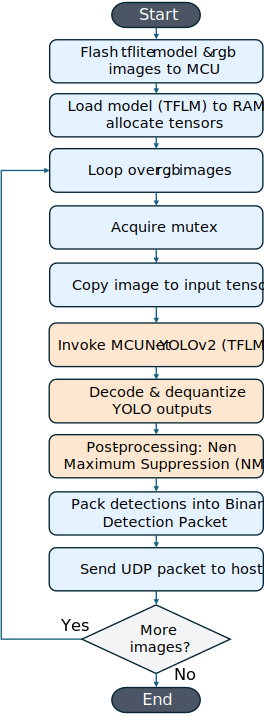

# Google Coral Dev Board Micro Deployment

This directory contains the firmware and utilities required to deploy the MCUNet-YOLOv2 model on the Google Coral Dev Board Micro.  
It includes preprocessing notebooks, inference firmware, and a Python UDP server for receiving detection results.

## Key Features

- **INT8 quantized MCUNet–YOLOv2 inference** running fully on Coral Dev Board Micro  
- **TensorFlow Lite Micro** deployment with a 1 MB tensor arena  
- **Custom post-processing pipeline**: YOLO decoding + Non-Maximum Suppression (NMS)  
- **Binary UDP streaming** of detection packets (zero-copy, fixed-layout structs)  
- **FreeRTOS task-based design** with mutex-protected shared interpreter state  
- **Image preprocessing utilities** (RGB converter notebook)  
- **Host-side Python UDP server** for real-time bounding-box reception and visualization 

## Project Structure
```text

google-coral-micro-object-detection/
├── firmware/
│   ├── coralmicro/                  # Coral Micro SDK (RTOS, drivers, Wi-Fi stack, build system)
│   └── object-detection-http/       # MCU deployment code (currently being refactored)
├── notebooks/
│   ├── generate_rgb_image.ipynb     # Preprocesses inference images into .rgb format with scaling considerations
│   └── tflite-runtime-test-object-detection.ipynb  
│                                    # Validates TFLite runtime behaviour and checks inference logic
└── pyserver/
    └── udp_server.py                # Host-side Python UDP server for receiving bounding-box messages from MCUs

```

## Firmware Configuration and Core Definitions

### MCUNet-YOLOv2 metadata
The file yolo_mcunet_metadata.hpp provides required model constants for post-processing:

- Anchor box shapes (anchor_widths, anchor_heights)
- grid_size 
- image_size (input image resolution)
- apply_exp_scaling flag for decoding YOLO width/height offsets

### Tensor Arena (1 MB)
```cpp
constexpr int kTensorArenaSize = 1024 * 1024; // 1MB
STATIC_TENSOR_ARENA_IN_SDRAM(tensor_arena, kTensorArenaSize);
```

- The tensor arena is a single static memory region used by TensorFlow Lite Micro for:
    - Input / output tensors
    - Intermediate activations
    - Scratch buffers and temporary workspaces
- 1 MB is selected as an upper bound that fits within the MCU’s SDRAM while providing enough headroom for:
    - The quantized MCUNet-YOLOv2 model (≈700 KB including weights & activations)
    - All intermediate tensors and operator scratch space
- `arena_used_bytes()` is printed at startup to verify actual memory utilisation.
 
### Semaphore for inference
```cpp
static SemaphoreHandle_t img_mutex;
```
`img_mutex` is a FreeRTOS mutex used to protect: 
1. The shared input tensor / image buffer and 
2. The TFLM interpreter state

This ensures that only one context can modify the tensor arena at a time and prevents race conditions if additional tasks are added.

### Binary detection packet format (Wi-Fi)
```cpp
#pragma pack(push, 1)
struct BinaryBBox {
    float xmin, ymin, xmax, ymax, score;
    uint8_t id;
};

struct BinaryDetectionPacket {
    uint32_t msg_id;
    uint32_t total_expected;
    uint32_t dtime;
    uint32_t num_bboxes;
    uint32_t payload_size;
    char image_filename[32];
    BinaryBBox bboxes[60]; // max_bboxes
};
#pragma pack(pop)
```

`BinaryBBox` stores one bounding box in a compact, fixed layout:
- Pixel coordinates (xmin, ymin, xmax, ymax)
- Confidence score
- id = class ID as an 8-bit integer

`BinaryDetectionPacket` (UDP message):
- Message metadata (msg_id, dtime, num_bboxes, etc.)
- A fixed-length filename
- Up to 60 detections (Payload)

#pragma pack(push, 1) removes padding so the struct’s memory layout matches the exact byte sequence sent over UDP. This ensures deterministic parsing on the Python host.

Packets are sent via:
```cpp
UdpSend(target_ip, target_port, (char*)&packet, sizeof(packet));
```

## Real-Time Inference Pipeline (InferenceTask)

The core program consists of two components: 
- `Main()` setup routine, and 
- `InferenceTask` FreeRTOS task that performs model execution and post-processing.

### Main()
Initializes system components required for inference:
- Blinks the status LED to indicate boot.
- Turns on Wi-Fi and obtains an IP address via DHCP.
- Creates img_mutex to protect the shared TFLM interpreter and input tensor.
- Starts the InferenceTask with an enlarged stack size

### InferenceTask 

#### Load model & validate schema

1. Load the quantized model from flash (/yolo_mcunet_model.tflite).
2. Parses it with `tflite::GetModel()`
3. checks that `model_data->version() == TFLITE_SCHEMA_VERSION`. 
    - If mismatched, the task safely suspends using vTaskSuspend(nullptr).

#### Register TensorFlow Lite Micro ops

Only the operators actually used by MCUNet-YOLOv2 are registered.

```cpp
tflite::MicroMutableOpResolver<16> resolver;
resolver.AddAdd();
resolver.AddPad();
resolver.AddConv2D();
resolver.AddDepthwiseConv2D();
resolver.AddReshape();
resolver.AddAveragePool2D();
resolver.AddLogistic(); // For sigmoid activation
resolver.AddMul();
resolver.AddConcatenation();
resolver.AddSpaceToDepth();
resolver.AddShape();
resolver.AddStridedSlice(); 
resolver.AddPack();
```

#### Initialize the TFLM interpreter & tensors
```cpp
tflite::MicroInterpreter interpreter(
    model_data, resolver, tensor_arena, kTensorArenaSize, &error_reporter
);
interpreter.AllocateTensors();
```

The interpreter is the TFLM runtime object that:
- Manages the tensor arena
- Allocates input/output/intermediate tensors
- Invokes each operator in order during Invoke()

#### Inference loop

Reads `.rgb` images stored in flash (`examples/images/`) and runs inference on each image:

For each image path:

1. Load RGB data: 
    - Read the raw RGB bytes into RAM (size = img_width * img_height * 3).

2. Acquire mutex
    - `xSemaphoreTake(img_mutex, pdMS_TO_TICKS(1000))`
    - Ensures exclusive access to the input tensor and interpreter.

3. Copy image into input tensor
    - For `kTfLiteInt8` models, the raw quantized bytes are copied directly into the input tensor buffer:
    ```cpp
    std::memcpy(
        tflite::GetTensorData<int8_t>(input_tensor),
        image_data.data(),
        image_data.size()
    );
    ```

4. Execute inference
    - Record `inference_start` timestamp.
	- Turn on `Led::kUser` to indicate an active inference.
	- Call `interpreter.Invoke()`.

5. Decode bounding boxes
    - Get raw output pointer:
        ```cpp
        uint8_t* raw_output = output_tensor->data.uint8;
        ```
    -  Call `DecodeBBoxes(raw_output, bbox_list, output_scale, output_zero_point)` to:
        - Dequantize logits
        - Apply sigmoid/exp
        - Convert from grid/anchor space to pixel coordinates
        - Filter by score threshold
        - Release `img_mutex`

6. Post-processing: Non-Maximum Suppression (NMS)
    - Sort bbox_list by score (descending).
    - For each pair of boxes with the same class ID:
	    - Compute IoU via CalculateIOU.
	    - If IoU > `iou_threshold`, keep the higher-score box and drop the other.
	- Truncate to at most `max_bboxes` detections.

7. Log per-image metrics

8. Send binary packet via Wi-Fi
    - Call `SendBBoxViaWiFiBinary(bbox_list, image_filename, wifi_msg_id, dtime, num_bboxes_output, rgb_files.size())`;
	- This constructs a BinaryDetectionPacket and sends it over UDP to the host.

## Workflow Summary 
